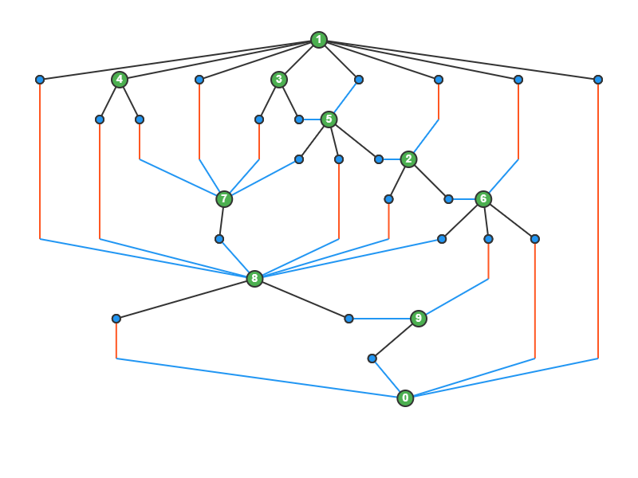
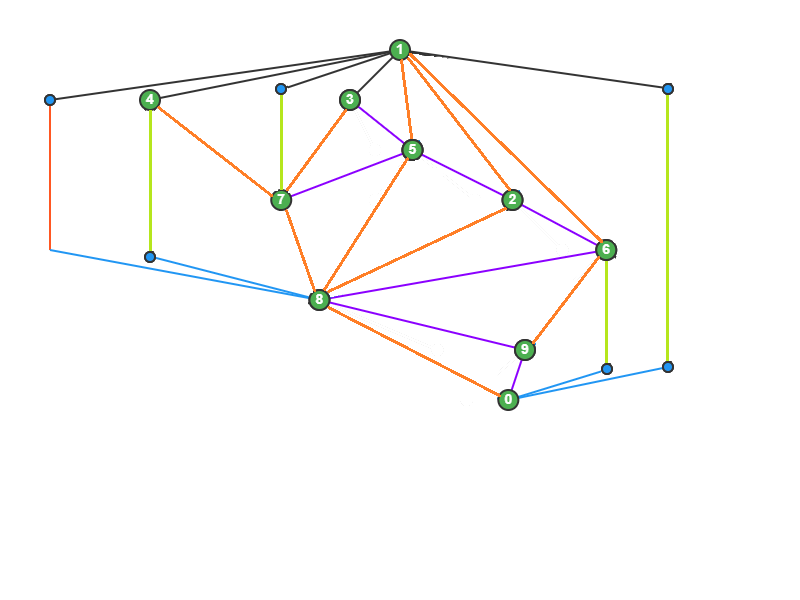
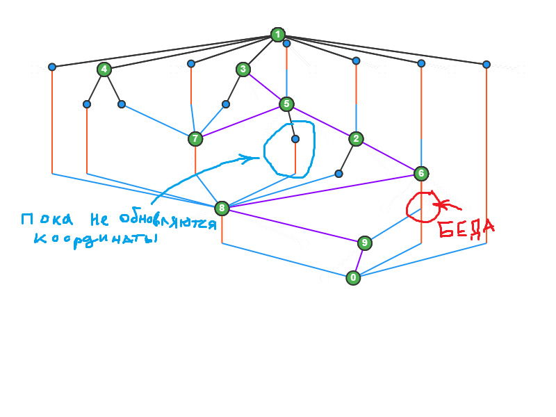
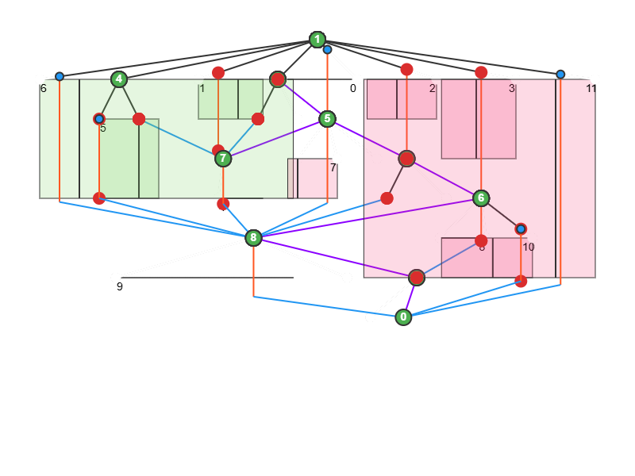
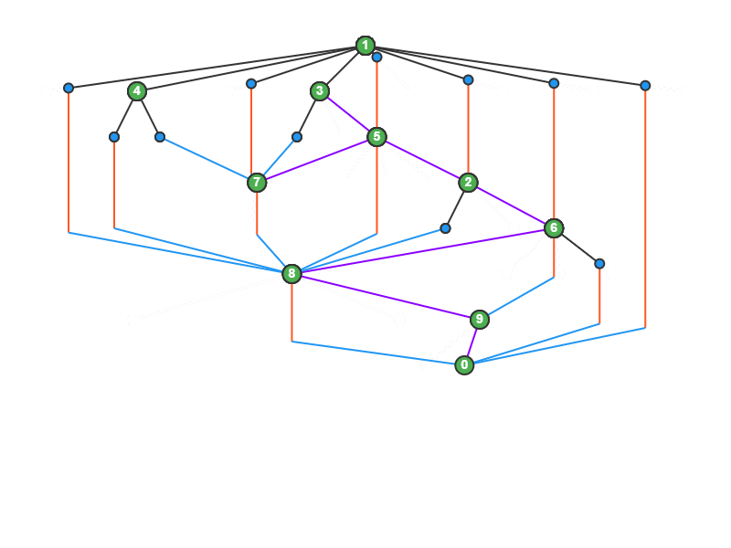

### ОБНОВА: наконец проект выходит из "замороженной" стадии
По "геометрически корректному эмбедингу" строится граф. А иммено для входа:
```
1 8 4 7 3 5 2 6 0
2 8 6
3 7 5
4 8 7
5 7 8 2
6 8 9 0
7 8
8 0 9
9 0
```
Получится:

<details>
<summary> Step 1. </summary>
 


</details>

<details>
<summary> Step 2. </summary>

Улучшенно построение рёбер между вершинами с разницой в один уровень. Также перестал добавляться дополнительный уровень при объединении многих рёберв одну вершину.



</details>


<details>
<summary> Step 3. (pre-release) </summary>

Попытка сближать (сдвигать) вертикальные рёбра чтобы уменьшить ширину. Углы входящих в вершины рёбер не меняются (но из-за сдвига вертикальных рёбер, входящие рёбра могут укрощаться). Вертикальное ребро сдвигается пока горизонтальное растояние до какого-то "узла" не станет `min_dX`, если изначально расстояние было меньше `min_dX`, то ребро никуда не перемещается (не происходит никакого отодвижения).


<details>
<summary> Промежуточные варианты </summary>
 






</details>



</details>

ДА ЁМАЁ, КОНЕЧНО ЖЕ ТАКОЕ УЖЕ ЕСТЬ,,,, (И НАВЕРНОЕ ПРИ ЭТОМ ЕЩЁ И ПРОЩЕ И ЛУЧШЕ!!) \
И оказывается это было даже в том [плейлесте](https://www.youtube.com/watch?v=3_FbSCWLC3A&list=PLubYOWSl9mIvoXDwf_Wqcrvlg15N_AWQE&index=38) только чуть ниже, см:  **SUGIYAMA FRAMEWORK**. 


### Мечты
* https://www1.pub.informatik.uni-wuerzburg.de/demos/forceDirected.html
* https://www.youtube.com/playlist?list=PLubYOWSl9mIvoXDwf_Wqcrvlg15N_AWQE

### WASM
Все коммуникации ведуться через $\text{int}$, $\text{vector\<int\>}$ и $\text{vector\<double\>}$. (мне лень было мучаться искать как передавать классы/структуры...) 

### Ход работы:
(ахахахахаххахахахахахахах, хпахпахпхаппха, спасибо продуктивному дню писания к первому дедлайну... а сейчас остается только возводить готический собор и молиться на него)

Что изучено:
(из книги “Вычислительная геометрия: введение”, Ф. Препарата, М. Шеймос):
Локализация точки на планарном разбиении с прямолинейными ребрами за $O(log N)$:
- методом цепей
- методом детализации триангуляции
- методом трапеций


В книге написано что это “оптимальная” сложность:\
Зейдель. Пусть есть N точек на плоскости (назовем их множеством S) и планарное разбиение с $\theta (N)$ областями. Тогда: \
(a) Потребуется $\Omega (N log N)$ на локализацию всех точек\
(b) Предположим что дополнительно известна триангуляция точек множества S. Триангуляция содержит информацию о том, как точки из S расположены относительно друг друга. Однако также потребуется $\Omega (N log N)$ на локализацию


Следующий шаги:
- Понять как (и где) визуализировать
- Написания генератора планарных графов и “переборной” локализации
- Определить получится ли использовать только целые числа, или придется использовать вещественные (тогда как соблюдать точность - возможно дробями)


Планируется:
- Проверка графа на планарность (https://neerc.ifmo.ru/wiki/index.php?title=Гамма-алгоритм).
- Оказывается любой планарный граф можно расположить так, чтобы все его ребра будут прямолинейными (пока не искал как произвести такое построение)
- Изучить триангуляцию


Источники:
- Вычислительная геометрия: введение, Ф. Препарата, М. Шеймос
- В википедии нашёл ссылку на: Martyn G. Taylor. Planarity Testing by Path Addition. — University of Kent, 2012.  [Архивировано 2 марта 2014 года.](https://archive.org/details/PlanarityTestingByPathAddition)
 
